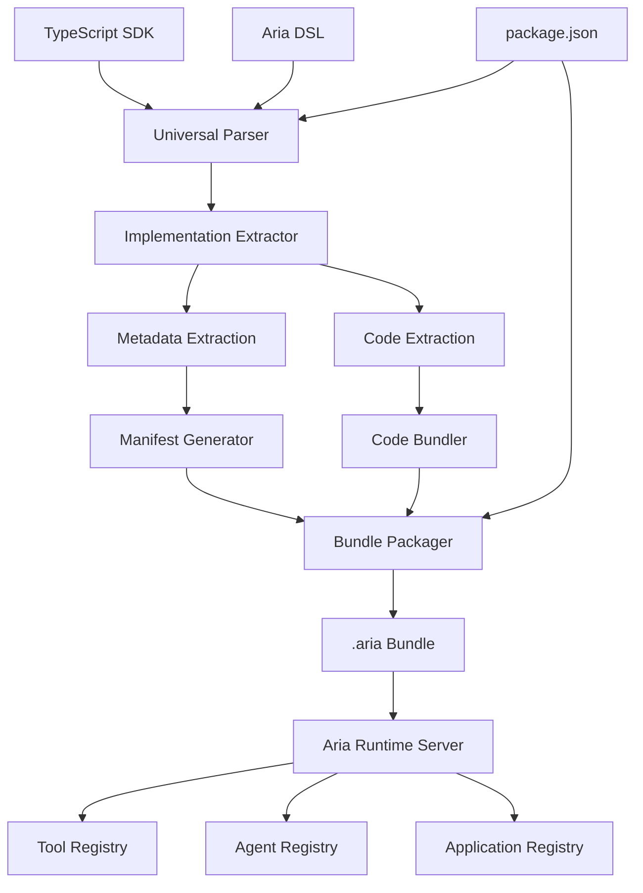

# Arc Compiler: Design & Implementation

Arc (Aria Compiler) is a universal Rust-based compiler that transforms decorator-based TypeScript SDK code and Aria DSL into executable `.aria` bundles for the Aria Firmware runtime server. It extracts both decorator metadata and complete implementation code, creating bundles that enable seamless tool/agent/application registration with persistent execution capabilities.

## 1. Overview & Architecture



### Core Responsibilities
- **Universal compilation** for TypeScript SDK and Aria DSL sources
- **Parse multi-language AST** for decorator-based configurations
- **Extract decorator metadata** from `@aria`, `@tool`, `@agent`, `@team`, `@app` decorators
- **Extract complete implementations** (functions, classes, applications) with full scope preservation
- **Generate manifest.json** with essential metadata for runtime registration
- **Bundle executable code** with proper module structure for runtime execution
- **Resolve dependencies** for runtime environment
- **Single binary distribution** with no runtime dependencies

## 2. Universal Compilation Strategy

### 2.1 Multi-Language Support

```rust
// Rust-based universal compiler architecture
pub enum SourceLanguage {
    TypeScript,  // SDK-based rapid development
    AriaSDL,     // DSL for stateful server applications
}

pub trait LanguageCompiler {
    fn parse(&self, source: &str) -> Result<AST, CompileError>;
    fn extract_implementations(&self, ast: AST) -> Vec<Implementation>;
    fn trace_dependencies(&self, node: &ASTNode) -> Vec<Dependency>;
}
```

### 2.2 Decorator Targets & Implementation Capture

```typescript
// TypeScript SDK Input: Decorated functions/classes
@tool({
  name: "authenticateUser",
  description: "Verify user credentials against database",
  inputs: { username: "string", password: "string" },
  outputs: { success: "boolean", userId?: "string", error?: "string" }
})
async function authenticateUser(params: { username: string, password: string }) {
  const user = await database.users.findOne({ username: params.username })
  if (!user || !await bcrypt.compare(params.password, user.hashedPassword)) {
    return { success: false, error: "Invalid credentials" }
  }
  return { success: true, userId: user.id }
}

// Arc Extraction Results:
// 1. Metadata → { name: "authenticateUser", description: "...", inputs: {...}, outputs: {...} }
// 2. Implementation → Complete function with dependencies, imports, scope
// 3. Bundle → Executable .aria bundle for runtime server
```

### 2.3 Implementation Extraction Requirements

The Rust AST parser must robustly extract:
- **Complete function/class bodies** with all logic, variables, closures
- **Dependency imports** used within implementations
- **Scope preservation** for variables, constants, helper functions
- **Async/await patterns** and promise handling
- **Error handling** and try/catch blocks
- **Type annotations** and runtime type information
- **Cross-language compatibility** for future DSL integration

## 3. Rust Compiler Implementation

### 3.1 Core Compiler Architecture

```rust
// src/compiler/mod.rs
pub struct AriaCompiler {
    typescript_compiler: TypeScriptCompiler,
    dsl_compiler: DslCompiler, // Future v2
}

pub struct CompilationResult {
    bundle: AriaBundle,
    diagnostics: Vec<Diagnostic>,
    build_metadata: BuildMetadata,
}

impl AriaCompiler {
    pub async fn compile(&self, config: BuildConfig) -> Result<CompilationResult> {
        // 1. Discover and parse source files
        let sources = self.discover_sources(&config.input)?;
        let mut implementations = Vec::new();
        
        // 2. Multi-language compilation
        for source in sources {
            match source.language {
                SourceLanguage::TypeScript => {
                    let ast = self.typescript_compiler.parse(&source.content)?;
                    let impls = self.typescript_compiler.extract_implementations(ast)?;
                    implementations.extend(impls);
                }
                SourceLanguage::AriaSDL => {
                    // Future: DSL compilation for stateful applications
                    let ast = self.dsl_compiler.parse(&source.content)?;
                    let impls = self.dsl_compiler.extract_implementations(ast)?;
                    implementations.extend(impls);
                }
            }
        }
        
        // 3. Generate unified manifest
        let manifest = self.generate_manifest(&implementations)?;
        
        // 4. Create .aria bundle
        let bundle = self.create_bundle(manifest, implementations)?;
        
        Ok(CompilationResult { bundle, diagnostics: vec![], build_metadata: BuildMetadata::new() })
    }
}
```

### 3.2 TypeScript Integration with SWC

```rust
// src/typescript/mod.rs
use swc_core::{
    ecma::{ast::*, parser::*, visit::*},
    common::SourceMap,
};

pub struct TypeScriptCompiler {
    source_map: SourceMap,
}

impl LanguageCompiler for TypeScriptCompiler {
    fn parse(&self, source: &str) -> Result<Module, CompileError> {
        let lexer = Lexer::new(
            Syntax::Typescript(TsConfig {
                decorators: true,
                tsx: true,
                ..Default::default()
            }),
            EsVersion::Es2022,
            StringInput::new(source, BytePos(0), BytePos(source.len() as u32)),
            None,
        );

        let mut parser = Parser::new_from(lexer);
        parser.parse_module().map_err(|e| CompileError::ParseError(e.to_string()))
    }

    fn extract_implementations(&self, ast: Module) -> Vec<Implementation> {
        let mut extractor = ImplementationExtractor::new();
        ast.visit_with(&mut extractor);
        extractor.implementations
    }
}

// AST Visitor for decorator extraction
struct ImplementationExtractor {
    implementations: Vec<Implementation>,
}

impl Visit for ImplementationExtractor {
    fn visit_fn_decl(&mut self, node: &FnDecl) {
        if let Some(decorators) = self.find_aria_decorators(node) {
            let implementation = Implementation {
                name: node.ident.sym.to_string(),
                impl_type: ImplementationType::Function,
                source_language: SourceLanguage::TypeScript,
                source_code: self.extract_function_code(node),
                executable_code: self.compile_to_javascript(node),
                decorators,
                dependencies: self.trace_dependencies(node),
            };
            self.implementations.push(implementation);
        }
    }
    
    fn visit_class_decl(&mut self, node: &ClassDecl) {
        if let Some(decorators) = self.find_aria_decorators(node) {
            let implementation = Implementation {
                name: node.ident.sym.to_string(),
                impl_type: ImplementationType::Class,
                source_language: SourceLanguage::TypeScript,
                source_code: self.extract_class_code(node),
                executable_code: self.compile_to_javascript(node),
                decorators,
                dependencies: self.trace_dependencies(node),
            };
            self.implementations.push(implementation);
        }
    }
}
```

### 3.3 Robust Implementation Extraction

```rust
// src/extractor/mod.rs
impl ImplementationExtractor {
    fn extract_function_code(&self, node: &FnDecl) -> String {
        // Extract complete function with full context:
        // - Function signature with types
        // - Full body with all statements  
        // - Async/await keywords
        // - JSDoc comments if present
        
        self.get_node_text_with_context(node)
    }
    
    fn trace_dependencies(&self, node: &dyn Node) -> Vec<Dependency> {
        let mut dependencies = Vec::new();
        let mut visitor = DependencyVisitor::new(&mut dependencies);
        node.visit_with(&mut visitor);
        
        // Resolve and validate all dependencies
        self.resolve_dependencies(dependencies)
    }
    
    fn validate_implementation(&self, impl: &Implementation) -> ValidationResult {
        let mut errors = Vec::new();
        
        // Syntax validation
        if !self.is_valid_syntax(&impl.executable_code) {
            errors.push(ValidationError {
                severity: ErrorSeverity::Error,
                message: "Extracted code contains syntax errors".to_string(),
                code: "INVALID_SYNTAX".to_string(),
            });
        }
        
        // Dependency validation
        if !self.all_dependencies_resolved(&impl.dependencies) {
            errors.push(ValidationError {
                severity: ErrorSeverity::Error,
                message: "Missing or unresolved dependencies".to_string(),
                code: "MISSING_DEPENDENCIES".to_string(),
            });
        }
        
        ValidationResult {
            valid: errors.is_empty(),
            errors,
        }
    }
}
```

## 4. Enhanced .aria Bundle Format

### 4.1 Universal Bundle Structure

```
myapp.aria (ZIP-based bundle)
├── manifest.json              # Runtime metadata for all implementations
├── implementations/           # Executable code organized by type
│   ├── tools/                 # @tool functions (SDK or DSL)
│   │   ├── authenticateUser.js
│   │   └── searchDatabase.js
│   ├── agents/                # @agent classes (SDK or DSL)
│   │   ├── UserAssistant.js
│   │   └── TechnicalSupport.js
│   ├── applications/          # @app stateful applications (DSL)
│   │   └── OrderProcessing.js
│   └── shared/                # Common utilities
│       ├── database.js
│       └── auth.js
├── package.json               # Runtime dependencies
└── metadata/
    ├── build.json            # Build metadata
    ├── dependencies.json     # Dependency graph
    └── source.json          # Source language mapping
```

### 4.2 Universal Bundle Schema

```rust
// src/bundle/mod.rs
#[derive(Serialize, Deserialize)]
pub struct AriaBundle {
    pub manifest: AriaManifest,
    pub implementations: HashMap<String, Implementation>,
    pub dependencies: Vec<Dependency>,
    pub metadata: BundleMetadata,
}

#[derive(Serialize, Deserialize)]
pub struct AriaManifest {
    pub name: String,
    pub version: String,
    pub tools: Vec<ToolManifest>,
    pub agents: Vec<AgentManifest>,
    pub applications: Vec<ApplicationManifest>, // DSL stateful applications
    pub teams: Vec<TeamManifest>,
    pub runtime_requirements: RuntimeRequirements,
}

#[derive(Serialize, Deserialize)]
pub struct Implementation {
    pub name: String,
    pub impl_type: ImplementationType,
    pub source_language: SourceLanguage,
    pub source_code: String,        // Original source
    pub executable_code: String,    // Compiled JavaScript for runtime
    pub dependencies: Vec<String>,
    pub decorators: Vec<DecoratorMetadata>,
}

#[derive(Serialize, Deserialize)]
pub enum ImplementationType {
    Function,    // @tool functions
    Class,       // @agent classes
    Application, // @app stateful applications (DSL)
    Service,     // Long-running services
}
```

## 5. Persistent Runtime Server Integration

### 5.1 Runtime Server Architecture

```rust
// src/runtime/server.rs
pub struct AriaRuntimeServer {
    tool_registry: ToolRegistry,
    agent_registry: AgentRegistry,
    application_registry: ApplicationRegistry,
    bundle_loader: BundleLoader,
    execution_engine: ExecutionEngine,
}

impl AriaRuntimeServer {
    pub async fn start(&mut self, config: RuntimeConfig) -> Result<()> {
        println!("🚀 Starting Aria Runtime Server on port {}", config.port);
        
        // Load initial bundles
        for bundle_path in &config.bundles {
            self.load_bundle(bundle_path).await?;
        }
        
        // Start HTTP/WebSocket server for runtime communication
        self.start_api_server(config.port).await?;
        
        Ok(())
    }
    
    pub async fn load_bundle(&mut self, bundle_path: &str) -> Result<()> {
        let bundle = self.bundle_loader.load(bundle_path).await?;
        
        // Register tools (from TS SDK or DSL)
        for tool_manifest in &bundle.manifest.tools {
            let implementation = bundle.get_implementation(&tool_manifest.name)?;
            let executable_tool = self.execution_engine.create_tool(implementation).await?;
            self.tool_registry.register(tool_manifest.name.clone(), executable_tool).await?;
            println!("✨ Registered tool: {}", tool_manifest.name);
        }
        
        // Register agents
        for agent_manifest in &bundle.manifest.agents {
            let implementation = bundle.get_implementation(&agent_manifest.name)?;
            let executable_agent = self.execution_engine.create_agent(implementation).await?;
            self.agent_registry.register(agent_manifest.name.clone(), executable_agent).await?;
            println!("🤖 Registered agent: {}", agent_manifest.name);
        }
        
        // Start stateful applications (DSL-based)
        for app_manifest in &bundle.manifest.applications {
            let implementation = bundle.get_implementation(&app_manifest.name)?;
            let application = self.execution_engine.create_application(implementation).await?;
            self.application_registry.start_application(app_manifest.name.clone(), application).await?;
            println!("🏗️ Started application: {}", app_manifest.name);
        }
        
        // Enable cross-bundle tool sharing
        self.update_agent_capabilities().await?;
        
        Ok(())
    }
    
    pub async fn hot_reload(&mut self, bundle_path: &str) -> Result<()> {
        println!("🔄 Hot reloading bundle: {}", bundle_path);
        self.unload_bundle(bundle_path).await?;
        self.load_bundle(bundle_path).await?;
        println!("✅ Hot reload complete");
        Ok(())
    }
}
```

### 5.2 Cross-Bundle Tool Sharing

```rust
// The "magic" - tools become available across all agents automatically
impl AriaRuntimeServer {
    async fn update_agent_capabilities(&mut self) -> Result<()> {
        let available_tools = self.tool_registry.list_all_tools().await;
        
        for agent in self.agent_registry.list_all_agents_mut().await {
            let relevant_tools = self.find_relevant_tools_for_agent(agent, &available_tools);
            if !relevant_tools.is_empty() {
                agent.expand_capabilities(relevant_tools).await?;
                println!("✨ Enhanced {} with {} new tools", 
                    agent.name(), relevant_tools.len());
            }
        }
        
        Ok(())
    }
}
```

## 6. CLI Interface & Distribution

### 6.1 Single Binary CLI

```bash
# Installation - single binary, no dependencies
curl -sSf https://aria.dev/install | sh
# or
cargo install aria-compiler

# Project initialization
arc new my-project --template=basic|sdk|dsl
cd my-project

# Build .aria bundle from TypeScript SDK
arc build ./src --output dist/myapp.aria

# Future: Build from Aria DSL
arc build ./app.aria --output dist/myapp.aria

# Development mode with hot reload
arc dev ./src --port 3000 --watch

# Validate implementations
arc check --strict

# Deploy to Aria Runtime Server
arc deploy dist/myapp.aria --server https://my-aria-server.com --auth-token abc123
```

### 6.2 CLI Implementation

```rust
// src/main.rs
use clap::{App, Arg, SubCommand};
use anyhow::Result;

#[tokio::main]
async fn main() -> Result<()> {
    let matches = App::new("arc")
        .version(env!("CARGO_PKG_VERSION"))
        .about("Aria Compiler - Universal agentic application compiler")
        .subcommand(
            SubCommand::with_name("build")
                .about("Compile TypeScript SDK or Aria DSL to .aria bundle")
                .arg(Arg::with_name("input").required(true).help("Source directory or file"))
                .arg(Arg::with_name("output").short("o").takes_value(true).help("Output .aria bundle path"))
                .arg(Arg::with_name("watch").short("w").help("Watch mode for development"))
        )
        .subcommand(
            SubCommand::with_name("dev")
                .about("Start development server with hot reload")
                .arg(Arg::with_name("port").short("p").takes_value(true).default_value("3000"))
        )
        .subcommand(
            SubCommand::with_name("deploy")
                .about("Deploy .aria bundle to runtime server")
                .arg(Arg::with_name("bundle").required(true))
                .arg(Arg::with_name("server").required(true))
        )
        .get_matches();

    match matches.subcommand() {
        ("build", Some(sub)) => {
            let compiler = AriaCompiler::new();
            let config = BuildConfig::from_args(sub);
            let result = compiler.compile(config).await?;
            println!("✅ Bundle created: {} bytes", result.bundle.size());
        }
        ("dev", Some(sub)) => {
            let dev_server = DevServer::new();
            dev_server.start(sub.value_of("port").unwrap().parse()?).await?;
        }
        ("deploy", Some(sub)) => {
            let deployer = BundleDeployer::new();
            deployer.deploy(
                sub.value_of("bundle").unwrap(),
                sub.value_of("server").unwrap()
            ).await?;
        }
        _ => println!("Use --help for usage information"),
    }

    Ok(())
}
```

## 7. Error Handling & Validation

### 7.1 Comprehensive Validation Pipeline

```rust
// src/validation/mod.rs
pub struct ValidationPipeline {
    syntax_validator: SyntaxValidator,
    dependency_validator: DependencyValidator,
    runtime_validator: RuntimeValidator,
}

impl ValidationPipeline {
    pub async fn validate_bundle(&self, bundle: &AriaBundle) -> ValidationResult {
        let mut errors = Vec::new();
        
        // Validate each implementation
        for implementation in bundle.implementations.values() {
            // Syntax validation
            if let Err(syntax_errors) = self.syntax_validator.validate(implementation) {
                errors.extend(syntax_errors);
            }
            
            // Dependency validation
            if let Err(dep_errors) = self.dependency_validator.validate(implementation) {
                errors.extend(dep_errors);
            }
            
            // Runtime validation (execute in test environment)
            if let Err(runtime_errors) = self.runtime_validator.validate(implementation).await {
                errors.extend(runtime_errors);
            }
        }
        
        ValidationResult {
            valid: errors.is_empty(),
            errors,
            warnings: vec![],
        }
    }
}
```

## 8. Future DSL Integration (v2)

### 8.1 Aria DSL Preview

```aria
// Example Aria DSL for stateful applications
@app({
  name: "order-processor",
  description: "Handles order processing workflow",
  state: persistent,
  scaling: horizontal
})
application OrderProcessor {
  state {
    orders: Map<OrderId, Order>
    inventory: Map<ProductId, Stock>
  }
  
  @tool
  fn processOrder(order: Order) -> Result<OrderStatus> {
    // DSL implementation
    let stock = this.inventory.get(order.productId)?;
    if stock.available >= order.quantity {
      this.orders.insert(order.id, order);
      this.inventory.update(order.productId, |s| s.available -= order.quantity);
      Ok(OrderStatus::Confirmed)
    } else {
      Ok(OrderStatus::BackOrdered)
    }
  }
}
```

### 8.2 DSL Compiler Architecture

```rust
// Future: src/dsl/mod.rs
pub struct DslCompiler {
    parser: DslParser,
    state_analyzer: StateAnalyzer,
    code_generator: DslCodeGenerator,
}

impl LanguageCompiler for DslCompiler {
    fn parse(&self, source: &str) -> Result<DslAST, CompileError> {
        self.parser.parse(source)
    }
    
    fn extract_implementations(&self, ast: DslAST) -> Vec<Implementation> {
        // Generate JavaScript implementations from DSL
        // Handle state management, persistence, scaling
        self.code_generator.generate_implementations(ast)
    }
}
```

---

**The Magic**: Arc compiler seamlessly transforms both TypeScript SDK and Aria DSL code into executable `.aria` bundles through universal Rust-based compilation. The persistent runtime server loads these bundles and automatically enables cross-bundle tool sharing, creating a composable ecosystem where agents gain capabilities as new tools are registered. Single binary distribution ensures zero-dependency deployment while robust AST parsing preserves complete executable fidelity - developers write in their preferred language, and the runtime gets complete, executable capabilities. 