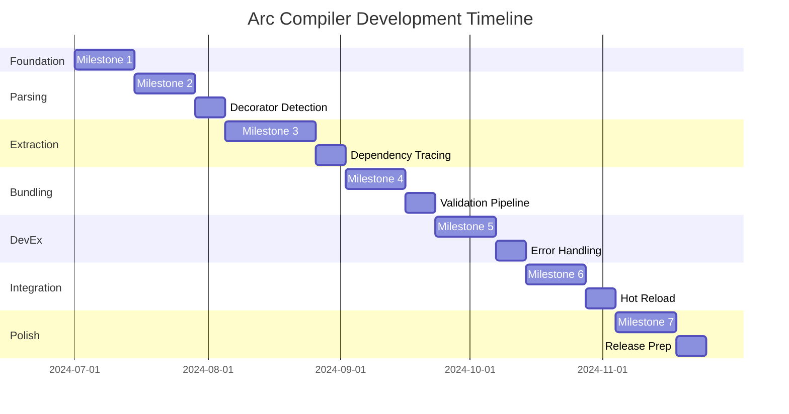

# Arc Compiler Development Plan

**Project**: Universal Agentic Platform Compiler  
**Language**: Rust  
**Target**: TypeScript SDK → .aria bundles (Phase 1)  
**Future**: Aria DSL support (Phase 2)  
**Timeline**: 12-16 weeks (Phase 1)

## 🎯 Project Overview

Arc is a high-performance Rust compiler that transforms TypeScript SDK code with Aria decorators into executable `.aria` bundles for persistent runtime servers. The architecture is designed for extensibility to support multiple source languages while maintaining consistent output format and runtime integration.

### Strategic Goals
- **Single Binary Distribution**: Zero-dependency CLI tool
- **Universal Compilation**: Extensible architecture for multiple source languages
- **Runtime Integration**: Seamless bundle loading and hot reload
- **Developer Experience**: Fast, reliable, clear error messages
- **Performance**: Sub-5s builds for typical projects

## 🏗️ Architecture Principles

### Core Design Decisions
1. **Modular Language Support**: Each language (TS, DSL) has its own compiler implementation
2. **Universal AST**: Common intermediate representation for all source languages
3. **Consistent Bundle Format**: `.aria` bundles work regardless of source language
4. **Extensible CLI**: Command structure supports future languages seamlessly
5. **Runtime Agnostic**: Compiler focuses on bundle creation, runtime handles execution

### Technology Stack
- **Parser**: SWC (TypeScript), Custom (future DSL)
- **CLI Framework**: Clap v4
- **Async Runtime**: Tokio
- **Serialization**: Serde with JSON/MessagePack
- **Bundle Format**: ZIP-based .aria files
- **Error Handling**: anyhow + thiserror

## 📋 Phase 1: TypeScript SDK Implementation

### Milestone 1: Foundation (Weeks 1-2) - ✅ COMPLETE
**Goal**: Basic project structure and CLI skeleton

#### Deliverables
- [x] Cargo workspace setup with proper modules
- [x] CLI argument parsing with clap
- [x] Basic project scaffolding (`arc new`)
- [x] Configuration file parsing (`aria.toml`)
- [x] Logging and error handling infrastructure

#### Success Criteria
```bash
# These commands work
arc new my-project --template=basic
cd my-project
arc build ./src  # Fails gracefully with "not implemented"
arc --help       # Shows all planned commands
```
**Status**: All deliverables for this milestone have been met. The core project scaffolding is complete, and the CLI is functional.

#### Technical Tasks
```rust
// Project structure
src/
├── main.rs           // CLI entry point
├── cli/
│   ├── mod.rs        // Command definitions
│   ├── build.rs      // Build command
│   ├── dev.rs        // Dev server command
│   └── new.rs        // Project scaffolding
├── compiler/
│   ├── mod.rs        // Main compiler interface
│   └── typescript/   // TS-specific implementation
├── bundle/
│   └── mod.rs        // Bundle creation/manipulation
└── config/
    └── mod.rs        // Configuration management
```

### Milestone 2: TypeScript Parsing (Weeks 3-4)
**Goal**: Parse TypeScript files and detect Aria decorators

**Specification**: The exact syntax, decorators, and arguments to be parsed are defined in `docs/SYNTAXDESIGN.md`.

#### Deliverables
- [ ] SWC integration for TypeScript parsing
- [ ] AST visitor for decorator detection
- [ ] Decorator metadata extraction
- [ ] Basic validation and error reporting

#### Success Criteria
```typescript
// Input: decorated TypeScript
@tool({ name: "test", description: "Test tool" })
function myTool() { return "hello"; }

// Output: Detected and parsed correctly
// Extracted metadata: { name: "test", description: "Test tool" }
```

#### Technical Implementation
```rust
// Core parsing pipeline
pub struct TypeScriptCompiler {
    source_map: SourceMap,
}

impl TypeScriptCompiler {
    pub fn parse_file(&self, path: &Path) -> Result<ParsedModule> {
        // SWC parsing with decorator support
    }
    
    pub fn extract_decorators(&self, module: &Module) -> Vec<DecoratorTarget> {
        // AST visitor implementation
    }
}
```

### Milestone 3: Implementation Extraction (Weeks 5-7)
**Goal**: Extract complete executable implementations with dependencies

#### Deliverables
- [ ] Function/class code extraction with full context
- [ ] Dependency tracing and resolution
- [ ] Import statement analysis
- [ ] Scope preservation logic
- [ ] Implementation validation pipeline

#### Success Criteria
```typescript
// Input: Complex decorated function
@tool({ name: "auth" })
async function authenticate(user: string) {
    const result = await database.findUser(user);
    return helper.processResult(result);
}

// Output: Complete extracted implementation
// - Full function code preserved
// - Dependencies: ['database', 'helper'] 
// - Imports: All necessary import statements
// - Validation: Syntax and dependency checks pass
```

#### Technical Challenges
- **Dependency Tracing**: Identify all used imports/variables
- **Scope Analysis**: Preserve closure variables and context
- **Code Boundaries**: Extract minimal but complete code
- **Validation**: Ensure extracted code is executable

### Milestone 4: Bundle Generation (Weeks 8-9)
**Goal**: Create complete .aria bundles with manifest and implementations

#### Deliverables
- [ ] Bundle format implementation (ZIP-based)
- [ ] Manifest generation from extracted metadata
- [ ] Code organization and bundling
- [ ] Package.json dependency resolution
- [ ] Bundle validation and integrity checks

#### Success Criteria
```bash
# Build produces valid .aria bundle
arc build ./src --output dist/myapp.aria

# Bundle contents:
# ├── manifest.json     # Complete metadata
# ├── implementations/  # Executable code
# ├── package.json      # Dependencies
# └── metadata/         # Build info
```

#### Bundle Structure
```rust
#[derive(Serialize, Deserialize)]
pub struct AriaBundle {
    pub manifest: AriaManifest,
    pub implementations: HashMap<String, Implementation>,
    pub dependencies: Vec<Dependency>,
    pub metadata: BundleMetadata,
}
```

### Milestone 5: Development Experience (Weeks 10-11)
**Goal**: Developer tooling and workflow optimization

#### Deliverables
- [ ] Watch mode for automatic rebuilds
- [ ] Development server with hot reload
- [ ] Comprehensive error messages with source locations
- [ ] Build performance optimization
- [ ] Progress indicators and build stats

#### Success Criteria
```bash
# Watch mode works smoothly
arc dev ./src --watch
# → Rebuilds on file changes
# → Clear error messages with file:line:column
# → Build time under 2s for incremental changes

# Validation provides actionable feedback
arc check --strict
# → Lists all issues with fixes
# → Zero false positives
```

### Milestone 6: Runtime Integration (Weeks 12-13)
**Goal**: Bundle loading and execution in runtime server

#### Deliverables
- [ ] Bundle loading/unloading functionality
- [ ] Hot reload implementation
- [ ] Tool/agent registration pipeline
- [ ] Cross-bundle tool sharing
- [ ] Runtime validation and error handling

#### Success Criteria
```rust
// Runtime can load bundles seamlessly
let runtime = AriaRuntimeServer::new();
runtime.load_bundle("dist/myapp.aria").await?;
// → Tools/agents registered and available
// → Hot reload works for development
```

### Milestone 7: Polish & Documentation (Weeks 14-16)
**Goal**: Production-ready release with comprehensive documentation

#### Deliverables
- [ ] Complete CLI help and documentation
- [ ] Error message improvements
- [ ] Performance benchmarking and optimization
- [ ] Integration tests and examples
- [ ] Release preparation and CI/CD

#### Success Criteria
- [ ] Build performance: <5s for typical projects, <30s for large projects
- [ ] Memory usage: <100MB for large projects
- [ ] Test coverage: >90% for core functionality
- [ ] Zero-dependency binary under 50MB

## 🔬 Testing Strategy

### Unit Tests
```rust
// Core functionality testing
#[cfg(test)]
mod tests {
    #[test]
    fn test_decorator_extraction() {
        // Test decorator parsing accuracy
    }
    
    #[test]
    fn test_dependency_tracing() {
        // Test dependency resolution
    }
    
    #[test]
    fn test_bundle_generation() {
        // Test bundle creation and validation
    }
}
```

### Integration Tests
```bash
# End-to-end workflow testing
tests/integration/
├── fixtures/          # Sample TypeScript projects
├── test_build.rs     # Build command testing
├── test_validation.rs # Validation testing
└── test_runtime.rs   # Runtime integration testing
```

### Performance Benchmarks
```rust
// Performance regression testing
#[bench]
fn bench_large_project_build(b: &mut Bencher) {
    // Benchmark build time for 1000+ decorated functions
}

#[bench]
fn bench_bundle_loading(b: &mut Bencher) {
    // Benchmark runtime bundle loading performance
}
```

## 🚀 Performance Targets

### Build Performance
- **Small Projects** (1-10 tools): <1s
- **Medium Projects** (10-100 tools): <5s  
- **Large Projects** (100+ tools): <30s
- **Incremental Builds**: <2s regardless of project size

### Runtime Performance
- **Bundle Loading**: <500ms for typical bundles
- **Hot Reload**: <1s end-to-end
- **Memory Usage**: <100MB for compiler, <50MB per loaded bundle

### Binary Size
- **Compiler Binary**: <50MB (including all dependencies)
- **Typical .aria Bundle**: <5MB
- **Bundle Compression**: >70% size reduction vs raw TypeScript

## 🔮 Phase 2: DSL Integration (Future)

### Pre-Architecture for DSL
The Phase 1 architecture is designed to accommodate DSL integration seamlessly:

```rust
// Already designed for multi-language support
pub trait LanguageCompiler {
    fn parse(&self, source: &str) -> Result<AST, CompileError>;
    fn extract_implementations(&self, ast: AST) -> Vec<Implementation>;
}

// Easy to add DSL compiler
pub struct AriaCompiler {
    typescript_compiler: TypeScriptCompiler,  // Phase 1
    dsl_compiler: DslCompiler,                // Phase 2
}
```

### DSL Integration Points
1. **Parser Module**: `src/compiler/dsl/` for DSL-specific parsing
2. **AST Extension**: Extend universal AST for DSL constructs
3. **Code Generation**: DSL → JavaScript compilation pipeline
4. **Bundle Schema**: Already supports multiple source languages
5. **CLI Commands**: `arc build` already designed for multi-language

### DSL Features to Support
- **Stateful Applications**: Persistent state management
- **Declarative Workflows**: Event-driven processing
- **Advanced Scaling**: Horizontal/vertical scaling directives
- **Type System**: Strong typing with inference
- **Runtime Optimization**: JIT compilation and caching

## 📊 Success Metrics

### Developer Experience
- **Time to First Build**: <2 minutes from `arc new` to working bundle
- **Error Resolution Time**: <30 seconds average from error to fix
- **Learning Curve**: Developers productive within 1 hour
- **Documentation Completeness**: 100% of public APIs documented

### Technical Metrics
- **Build Reliability**: >99.9% success rate for valid TypeScript
- **Bundle Validation**: 100% of generated bundles execute correctly
- **Performance Regression**: <5% degradation between versions
- **Memory Leaks**: Zero memory leaks in long-running builds

### Ecosystem Growth
- **Community Adoption**: Track GitHub stars, downloads
- **Bundle Registry**: Foundation for bundle sharing ecosystem
- **Third-party Tools**: Enable IDE extensions, plugins

## 🛠️ Development Workflow

### Daily Development
```bash
# Development cycle
git checkout -b feature/decorator-extraction
cargo test                    # Run tests
cargo run -- build examples/ # Test on examples
cargo clippy                  # Linting
git commit -m "feat: decorator extraction"
```

### Release Process
```bash
# Release preparation
cargo test --all-features     # Full test suite
cargo bench                   # Performance benchmarks
cargo build --release         # Optimized build
cargo audit                   # Security audit
git tag v0.1.0                # Version tagging
```

### Code Quality
- **Rust Standards**: Follow official Rust style guidelines
- **Documentation**: All public APIs have rustdoc comments
- **Error Messages**: User-friendly with actionable suggestions
- **Performance**: Profile and optimize hot paths
- **Security**: Regular dependency audits and updates

## 📅 Timeline & Milestones



## 🎉 Definition of Done

### Phase 1 Complete When:
- [ ] TypeScript projects compile to valid .aria bundles
- [ ] Runtime can load and execute bundles correctly
- [ ] Development workflow is smooth and fast
- [ ] Documentation is complete and accurate
- [ ] Performance targets are met
- [ ] Test coverage exceeds 90%
- [ ] Zero critical bugs in issue tracker
- [ ] Community can successfully use the tool

### Ready for Phase 2 When:
- [ ] Architecture cleanly supports new language compilers
- [ ] Bundle format accommodates DSL-specific features
- [ ] Runtime handles multi-language implementations
- [ ] Performance scales with additional languages
- [ ] Developer experience remains consistent

---

**Next Steps**: Begin with Milestone 1 - Foundation setup. Focus on getting the basic project structure and CLI framework working before moving to TypeScript parsing. 